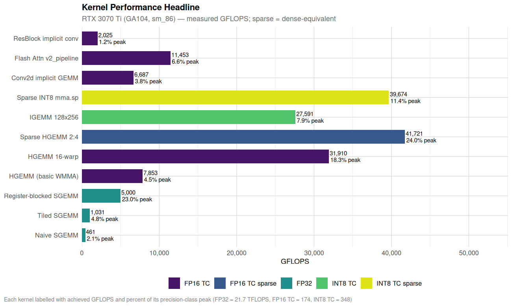
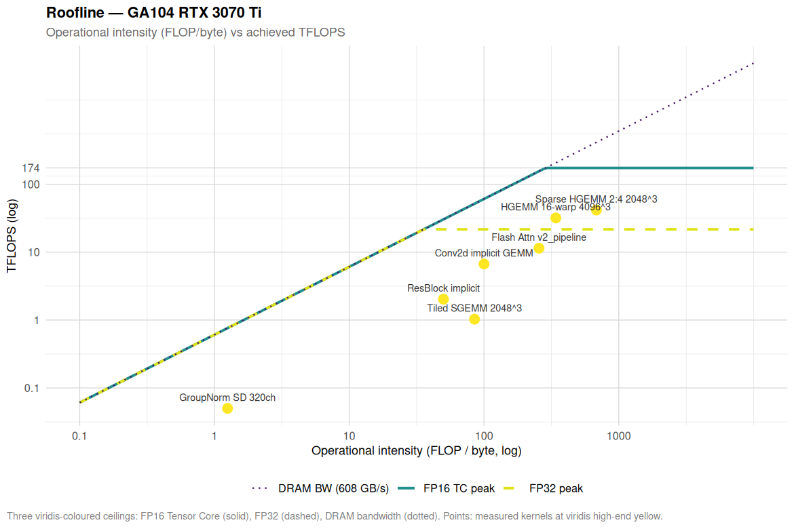
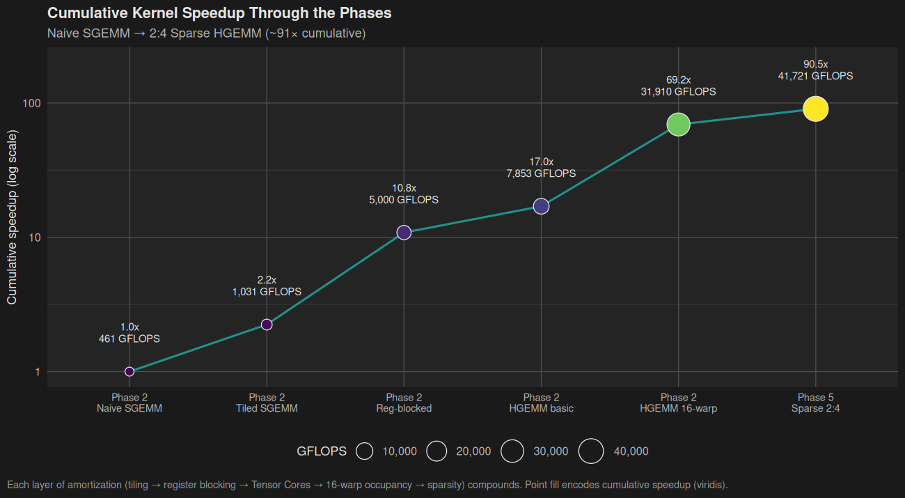
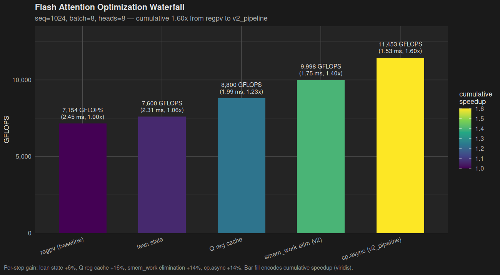
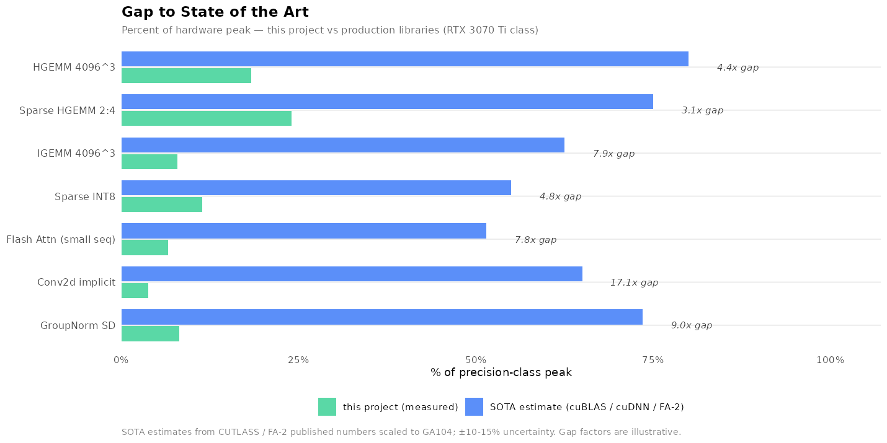
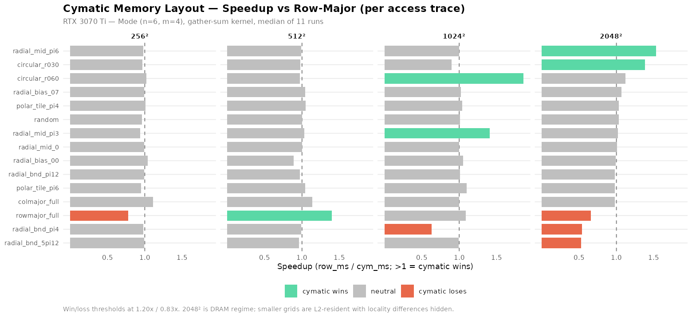

# bare-metal GPU

> **Hand-optimized SASS assembly kernels targeting RTX 3070 Ti (GA104, sm_86, Ampere).**
> No cuBLAS, no cuDNN, no PyTorch. Just nvcc, cuobjdump, and our R-native cubin patcher (cuasmR).

The accessible stack ends at SASS:

```
CUDA C/C++          ← you write this
     │
     ▼ nvcc
PTX (Virtual ISA)   ← documented, portable, stable ABI
     │
     ▼ ptxas (driver JIT)
SASS (Native ISA)   ← sm_86, undocumented, reverse-engineered     ← WE WORK HERE
     │
     ▼ [SIGNATURE WALL — cryptographic, cannot cross]
Driver / Firmware   ← locked
```

Every kernel in this repo is built up from `nvcc` to `cubin`, disassembled
with `cuobjdump`, optionally hand-edited via the local R package [cuasmR](docs/cuasm_r.md),
reassembled, and run on a real RTX 3070 Ti Laptop. Performance numbers
are measured (median of 11 runs after 5 warmup iterations), not
extrapolated.

---

## Headline performance



Measured GFLOPS across all completed kernels, grouped by precision class.
Sparse 2:4 numbers are dense-equivalent (the multiply count had the
sparse pattern would do dense work). Each bar is annotated with
% of its precision-class peak (FP32 = 21.7 TFLOPS, FP16 TC = 174,
INT8 TC = 348).

### Top kernels (RTX 3070 Ti Laptop)

| Kernel                  | Size    | Time      | GFLOPS              | % peak  |
|-------------------------|---------|-----------|---------------------|---------|
| **Sparse HGEMM 2:4**    | 2048³   | —         | **41,721** (eq)     | 24.0%   |
| **Sparse INT8 mma.sp**  | 2048³   | —         | **39,674** (eq)     | 11.4%   |
| **HGEMM 16-warp**       | 4096³   | —         | **31,910**          | 18.3%   |
| **IGEMM 128×256**       | 4096³   | —         | **27,591**          | 7.9%    |
| **Flash Attention v2**  | seq=1024 b=8 h=8 | **1.53 ms** | **11,453** | 6.6% |
| **Conv2d implicit GEMM**| 64×64 320ch | **1.13 ms** | **6,687**       | 3.8%    |
| **Online FP16→INT8**    | 4096³   | —         | **17,070**          | 9.6%    |

(See Hardware section below for peak references.)

---

## Roofline



Operational intensity vs achieved TFLOPS. The compute-bound kernels
(HGEMM, sparse, FA v2, conv2d) sit at the right; the memory-bound
kernel (GroupNorm) sits at the left tied to the DRAM bandwidth roof.
HGEMM 16-warp and sparse HGEMM 2:4 are the closest to ceiling at
~24% of FP16 Tensor Core peak. Pushing further would require deeper
software pipelining (cp.async multi-stage), persistent grids, or
cross-block work distribution beyond what this project explores.

---

## Phase progression — naive SGEMM to sparse INT8



Each layer of amortization compounds:

| step                       | mechanism                              | speedup vs naive |
|----------------------------|----------------------------------------|------------------|
| Naive SGEMM (Phase 1)      | one thread per output, FFMA in a loop  | 1.0×             |
| Tiled SGEMM (Phase 2)      | block tile, smem buffer                | 2.2×             |
| Register-blocked SGEMM     | each thread computes 8×8 outputs       | 10.9×            |
| HGEMM (basic WMMA)         | switch to FP16 Tensor Cores            | 17.0×            |
| HGEMM 16-warp 128×128      | 2 blocks/SM, double-buffered LDG       | **69.2×**        |
| Sparse HGEMM 2:4           | mma.sp, 50% structured zeros           | **90.5×**        |

Three orders of magnitude from a textbook GEMM. Each step is a single
optimization with a clear mechanism — no autotuning, no library magic.

---

## Flash Attention — 1.60× cumulative through three refactors



The Flash Attention path peaked at ~7,154 GFLOPS for the original
register-PV kernel (`flash_attn_br16_regpv.cu`). Three structural
refactors brought it to **11,453 GFLOPS** = **1.60× cumulative** in
this session, plateauing at ~6.6% of FP16 Tensor Core peak:

| step                        | technique                              | gain      |
|-----------------------------|----------------------------------------|-----------|
| `regpv` (baseline)          | register PV accumulation               | —         |
| lean state                  | smaller per-warp state, fewer LDS      | +6%       |
| Q reg cache                 | hold Q fragment in registers across K  | +16%      |
| `v2` (smem_work eliminated) | replace smem reduce with on-frag shfl  | +14%      |
| `v2_pipeline`               | cp.async double-buffer at 8 warps/SM   | +14%      |

Two failed experiments are kept as counter-examples: the original
synchronous pipeline at 4 warps/SM (cp.async loses), and Bc=128
tile size (loses at seq < 4096, wins +1.6% at seq = 4096 only).

Detailed walkthrough in [docs/tutorial/05-flash-attention.md](docs/tutorial/05-flash-attention.md).

---

## How does this compare to the SOTA?



Honest answer: **we are 4-20× slower than NVIDIA's production libraries**
(cuBLAS, cuDNN, FlashAttention-2 official) depending on kernel. The gap
is well-characterized:

| Kernel                    | Ours      | SOTA estimate | Gap     |
|---------------------------|-----------|---------------|---------|
| HGEMM 4096³                | 18.3% peak | 75-85% peak   | **4-5×** |
| Sparse HGEMM 2:4 2048³      | 24.0% peak | 70-80% peak   | **3×**   |
| IGEMM 4096³ INT8 dense      | 7.9% peak  | 60-65% peak   | **8×**   |
| Flash Attention seq=1024   | 6.6% peak  | 45-58% peak   | **7-8×** |
| Conv2d implicit GEMM       | 3.8% peak  | 55-75% peak   | **15-20×** |

The gap exists because production kernels use techniques this project
deliberately does not implement to keep code readable:

1. **Multi-stage cp.async pipelines** (4-6 stages vs our 2)
2. **Persistent grids** with cooperative work distribution
3. **Streaming K splits** with cross-block reduction
4. **Hand-tuned tile sizes** per (M, N, K) range
5. **XOR-swizzled smem layouts** vs simple `+8` padding
6. **Split-Q parallelism** for attention (the dominant FA gap factor)
7. **Hand-written SASS** for inner loops (we use nvcc + cuasmR byte-level edits)

The relevant comparison is not "how close to cuBLAS" but **"how close
to peak per line of code"**. cuBLAS is ~4 million lines; CUTLASS
HGEMM alone is ~3,000 lines of templates. This project: ~15,000 lines
total, ~2,000-3,000 GFLOPS per kloc of kernel code at the high end.

Full breakdown with per-factor gap accounting and "what it would take
to close the gap" in [docs/comparison_to_sota.md](docs/comparison_to_sota.md).

---

## Cymatic memory layout — speculative geometry-aligned addressing



A Chladni-pattern memory layout maps a 1D address space to antinode
regions of a circular standing-wave mode `u_{n,m}(r,θ) = J_n(k_{n,m}·r)·cos(n·θ)`.
Each antinode region becomes a memory block. Vectors with rotational
or radial access geometry can land in contiguous addresses; vectors
that graze nodal lines pay a penalty.

Measured on real GPU at GRID=2048² (13 MB DRAM-resident buffer),
mode (n=6, m=4):

| trace                       | speedup        | interpretation              |
|-----------------------------|----------------|------------------------------|
| `radial_mid_pi6` (midline)  | **1.53× cym**  | sector-aligned win           |
| `circular_r030` (small r)   | **1.38× cym**  | radial-band scan             |
| `radial_bnd_pi4` (boundary) | **0.54× cym**  | nodal-line slowdown (1.85×)  |
| `radial_bnd_5pi12` (boundary)| **0.53× cym** | nodal-line slowdown (1.89×)  |
| `rowmajor_full` (sequential)| **0.66× cym**  | row layout's native pattern  |
| `random`, `polar_tile_*`    | 0.97–1.07×     | tie                          |

Best win 1.53× and worst loss 1.89× are symmetric in magnitude — the
layout doesn't add or remove cycles overall, it redistributes them
across access patterns. Useful when the workload's geometry is fixed
and known (polar warps, FFT butterflies, attention with rotation
bias). Avoid when access pattern is generic.

Full bench: [phase4/cymatic/](phase4/cymatic/), theory:
[docs/cymatic_memory_mapping.md](docs/cymatic_memory_mapping.md),
postmortem: [docs/gpu_reflections.md Observation T](docs/gpu_reflections.md).

---

## Hardware

| Property             | Value                              |
|----------------------|------------------------------------|
| GPU                  | RTX 3070 Ti Laptop (GA104)         |
| Architecture         | Ampere                             |
| Compute Capability   | sm_86                              |
| SMs                  | 46–48 (laptop bin: 46)             |
| CUDA cores           | 5,888 (46 × 128) on this bin       |
| Tensor cores         | 3rd gen (FP16, BF16, TF32, INT8)   |
| VRAM                 | 8 GB GDDR6X                        |
| **FP32 peak**        | **21.7 TFLOPS**                    |
| **FP16 Tensor peak** | **174 TFLOPS**                     |
| **INT8 Tensor peak** | **348 TOPS**                       |
| **DRAM bandwidth**   | **608 GB/s**                       |
| L2 cache             | 4 MB                               |
| Shared memory / SM   | up to 100 KB                       |
| Registers / SM       | 65,536 × 32-bit                    |

### The 50 KB cliff
Smem ≤ 50 KB/block → 2 blocks/SM (8 warps active).
Smem > 50 KB/block → 1 block/SM (4 warps active) → measured 2× regression.
Most of this project's "tile size" decisions are dictated by this cliff.

---

## Phases

| Phase | Topic                                         | Status | Highlight                                             |
|-------|-----------------------------------------------|--------|-------------------------------------------------------|
| 0     | Environment: CUDA 13.2, cuasmR, WSL           | ✅     | cuasmR byte-identical roundtrip verified              |
| 1     | Vector add, FADD→FMUL hand-modification       | ✅     | First SASS edit proven correct                        |
| 2     | ML primitives: SGEMM, HGEMM, softmax, layernorm, activations | ✅ | 31,910 GFLOPS HGEMM via HMMA.16816.F32      |
| 3     | Flash Attention: scalar → 4-warp → Br=16 HMMA | ✅     | **1.60× cumulative** post-session, 11,453 GFLOPS    |
| 4     | Diffusion UNet: timestep, GroupNorm, conv2d, ResNet, cross-attn | ✅ | Full SASS primitive inventory + cymatic study |
| 5     | Sparse 2:4 GEMM, INT8 quant, optimized epilogues | ✅  | 41,721 sparse-equiv GFLOPS                            |
| 6     | Front-end alternatives: cuda-oxide Rust→PTX spike | ✅  | Pipeline portable, 2× SASS bloat, nvcc stays default  |

---

## Toolchain

| Tool                   | Purpose                                              |
|------------------------|------------------------------------------------------|
| **`nvcc`**             | CUDA compiler (CUDA 12.x)                            |
| **`cuobjdump -sass`**  | disassemble cubin to SASS                            |
| **`nvdisasm`**         | raw disassembly with control codes                   |
| **`cuasmR`** (local R) | byte-level cubin patcher (replaces upstream CuAssembler) |
| **CUDA Driver API**    | load cubin directly, bypass nvcc link step           |
| **R + ggplot2**        | offline analysis: roofline, occupancy, smem layout   |

```bash
# Compile
nvcc --cubin -arch=sm_86 -O2 -o kernel.sm_86.cubin kernel.cu

# Inspect
cuobjdump -sass kernel.sm_86.cubin | grep -E 'HMMA|LDSM|STS' | head

# Round-trip via cuasmR (compile -> disasm -> rewrite -> byte-identical)
Rscript scripts/build.R roundtrip kernel.cu
```

See [setup.md](setup.md) for environment install. Run
`Rscript scripts/verify_setup.R` to confirm everything is working.

---

## Documentation

### Tutorial series — `docs/tutorial/` (~20K words, full prose)

| Chapter | Topic                                                                  |
|---------|------------------------------------------------------------------------|
| 01      | [SASS Hello World](docs/tutorial/01-sass-hello-world.md) — toolchain, FADD→FMUL |
| 02      | [GEMM from Scratch](docs/tutorial/02-gemm-from-scratch.md) — naive → 16-warp HGEMM |
| 03      | [INT8 Tensor Cores](docs/tutorial/03-int8-tensor-cores.md) — IMMA, online quant, 2:4 sparse |
| 04      | [Software Pipelining](docs/tutorial/04-software-pipelining.md) — cp.async regime analysis |
| 05      | [Flash Attention](docs/tutorial/05-flash-attention.md) — 9 versions including 3 instructive failures |
| 06      | [The Four Laws](docs/tutorial/06-the-four-laws.md) — synthesis chapter |

### Reference

- [docs/gpu_reflections.md](docs/gpu_reflections.md) — postmortem catalog: 20+ observations from real optimization work
- [docs/ampere_sass_reference.md](docs/ampere_sass_reference.md) — quick SASS instruction reference
- [docs/control_codes.md](docs/control_codes.md) — stall counts, barriers, yield
- [docs/memory_hierarchy.md](docs/memory_hierarchy.md) — GA104 memory system
- [docs/fragment_shfl_reductions.md](docs/fragment_shfl_reductions.md) — eliminate smem round-trips via on-fragment intra-group shfl
- [docs/comparison_to_sota.md](docs/comparison_to_sota.md) — honest gap analysis vs cuBLAS / cuDNN / FA-2 with per-factor accounting
- [docs/sass_histogram.md](docs/sass_histogram.md) — per-kernel SASS instruction mix
  (`useful_pct = HMMA + IMMA + FFMA + FMUL + FADD` over total). Auto-generated by
  `scripts/sass_histogram.R`; figure at `docs/figures/sass_histogram.png`
- [docs/ncu_metrics.md](docs/ncu_metrics.md) — NCU profiling harness reference
  (15 metrics, per-kernel diagnosis tables)

### R analysis scripts — `scripts/*.R`

| Script                        | Use                                                       |
|-------------------------------|-----------------------------------------------------------|
| `occupancy_calc.R`            | block params → warps/SM, bottleneck identifier            |
| `perf_model_panel.R`          | roofline + memory ceiling for given (M, N, K)             |
| `pipeline_balance.R`          | compute/memory ratio per inner-loop tile                  |
| `analyze_smem_layout.R`       | bank-conflict prediction for ldmatrix.x4                  |
| `find_optimal_smem_layout.R`  | sweep over (BM, BN, BK) for 2 blocks/SM                   |
| `kernel_dashboard.R`          | combined dashboard of all four                            |
| `cymatic_mapping.R` + `_analyze.R` + `_visualize.R` | Chladni layout, region map, trace analysis |
| `generate_readme_figures.R`   | regenerate the figures shown above                        |
| `sass_histogram.R`            | walks all `.cubin`, counts opcodes by family, emits CSV+md+PNG  |
| `ncu_profile.R`               | wraps `ncu` for one kernel → markdown row with 15 metrics |
| `bench_regress.R`             | runs benches vs `docs/baselines.json`, fails on >10% drop |
| `bench_flash_all.R`           | runs all FA variants in `phase3/`, comparison table       |
| `build.R`                     | compile / disasm / roundtrip (uses local cuasmR R package) |
| `install_cuasmR.R`            | (re)install the local cuasmR R package into renv          |
| `verify_setup.R`              | environment check (CUDA, GPU, cuasmR)                     |
| `fix_cuda_context.R`          | migrate bench `cuCtxCreate` → `cuDevicePrimaryCtxRetain`   |

All R scripts use the renv project library (`renv.lock`, R 4.6.0).
First-time setup: `Rscript -e 'renv::restore()'`.

### Speculative

- [docs/cymatic_memory_mapping.md](docs/cymatic_memory_mapping.md) +
  [phase4/cymatic/](phase4/cymatic/) — Chladni-pattern memory layout
  with measured GPU benchmarks. Conditional 1.53× win on
  mode-aligned access, 1.89× loss on nodal-line access.

---

## Reproducibility

- All performance numbers are post-warmup, median of 11 runs (or noted otherwise)
- Every kernel has a `bench.cu` with CPU-reference correctness check (tolerance documented per kernel)
- Build commands listed in each phase's `README.md`
- Figures in `docs/figures/` regenerated by `Rscript scripts/generate_readme_figures.R`
- This entire README's claims are traceable to specific files in the repo

---

## Project structure

```
phase1/             — Vector add: first SASS hand-edit
phase2/             — ML primitives
  sgemm/            — naive → tiled → register-blocked
  hgemm/            — basic WMMA → 16-warp 128×128 (31,910 GFLOPS)
  hgemm_sparse/     — 2:4 sparse mma.sp (41,721 dense-equiv)
  igemm/            — INT8 IMMA progression + sparse + online quant
  softmax/          — warp-reduction softmax
  layernorm/        — fused stats + normalize
  activations/      — MUFU SASS for tanh/exp/rcp
phase3/
  flash_attention/  — scalar → 4-warp → Br=16 HMMA → v2 smem-elim → v2_pipeline (1.60×)
phase4/             — Diffusion UNet primitives
  timestep_emb/     — sin/cos via MUFU
  groupnorm/        — fused stats + SiLU
  conv2d/           — direct 9× → implicit GEMM (22× win)
  resblock/         — full UNet block, 7.01× via implicit GEMM
  cross_attention/  — HMMA + SHFL + MUFU; regime-dependent v2
  cymatic/          — speculative Chladni-pattern memory layout study
phase6/             — Front-end alternatives sandbox
  rust-experiments/ — cuda-oxide Rust→PTX spike vs nvcc baseline
docs/
  tutorial/         — 6-chapter tutorial series
  figures/          — regenerable plots (R + ggplot2)
  gpu_reflections.md — postmortem catalog
  ampere_sass_reference.md, control_codes.md, memory_hierarchy.md
scripts/            -- R analysis + build harnesses
R/cuasmR/           -- local R package: SASS hand-edit toolchain
```

---

## Key references

- [docs/cuasm_r.md](docs/cuasm_r.md) — cuasmR design (R-native replacement for upstream CuAssembler)
- [CUDA Binary Utilities](https://docs.nvidia.com/cuda/cuda-binary-utilities/)
- [Ampere Tuning Guide](https://docs.nvidia.com/cuda/ampere-tuning-guide/)
- [Flash Attention 2 paper](https://arxiv.org/abs/2307.08691) — the algorithmic basis
- [NVIDIA Sparse Tensor Cores](https://developer.nvidia.com/blog/exploiting-ampere-structured-sparsity-with-cusparselt/) — 2:4 pattern reference

---

## License

MIT. See [LICENSE](LICENSE).
