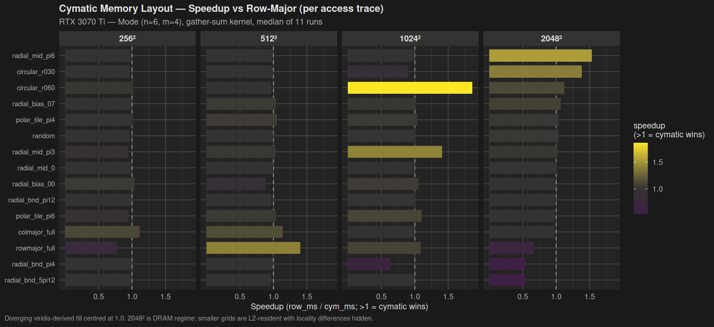

# bare-metal GPU

> **Hand-optimized SASS assembly kernels targeting RTX 3070 Ti (GA104, sm_86, Ampere).**
> No cuBLAS, no cuDNN, no PyTorch. Just nvcc, cuobjdump, and our R-native cubin patcher (cuasmR).

The accessible stack ends at SASS:

```
CUDA C/C++          ← you write this
     │
     ▼ nvcc
PTX (Virtual ISA)   ← documented, portable, stable ABI
     │
     ▼ ptxas (driver JIT)
SASS (Native ISA)   ← sm_86, undocumented, reverse-engineered     ← WE WORK HERE
     │
     ▼ [SIGNATURE WALL — cryptographic, cannot cross]
Driver / Firmware   ← locked
```

Every kernel in this repo is built up from `nvcc` to `cubin`, disassembled
with `cuobjdump`, optionally hand-edited via the local R package [cuasmR](docs/cuasm_r.md),
reassembled, and run on a real RTX 3070 Ti Laptop. Performance numbers
are measured (median of 11 runs after 5 warmup iterations), not
extrapolated.

**Per-kernel data:** [`docs/inventory.md`](docs/inventory.md) is the
single entry point for all comparison views (headline wins, SASS mix,
register audit, roofline, vs reference libraries, baselines, source
paths).

---

## Headline performance


Measured GFLOPS across all completed kernels, grouped by precision class.
Sparse 2:4 numbers are dense-equivalent (the multiply count had the
sparse pattern would do dense work). Each bar is annotated with
% of its precision-class peak (FP32 = 21.7 TFLOPS, FP16 TC = 174,
INT8 TC = 348).

### Top kernels (RTX 3070 Ti Laptop)

| Kernel                  | Size    | Time      | GFLOPS              | % peak  |
|-------------------------|---------|-----------|---------------------|---------|
| **Sparse HGEMM 2:4**    | 2048³   | —         | **41,721** (eq)     | 24.0%   |
| **Sparse INT8 mma.sp**  | 2048³   | —         | **39,674** (eq)     | 11.4%   |
| **HGEMM 16-warp**       | 4096³   | —         | **31,910**          | 18.3%   |
| **IGEMM 128×256**       | 4096³   | —         | **27,591**          | 7.9%    |
| **Flash Attention v2**  | seq=1024 b=8 h=8 | **1.53 ms** | **11,453** | 6.6% |
| **Conv2d implicit GEMM**| 64×64 320ch | **1.13 ms** | **6,687**       | 3.8%    |
| **Online FP16→INT8**    | 4096³   | —         | **17,070**          | 9.6%    |

(See Hardware section below for peak references.)

---

## Roofline


Operational intensity vs achieved TFLOPS. The compute-bound kernels
(HGEMM, sparse, FA v2, conv2d) sit at the right; the memory-bound
kernel (GroupNorm) sits at the left tied to the DRAM bandwidth roof.
HGEMM 16-warp and sparse HGEMM 2:4 are the closest to ceiling at
~24% of FP16 Tensor Core peak. Pushing further would require deeper
software pipelining (cp.async multi-stage), persistent grids, or
cross-block work distribution beyond what this project explores.

---

## Phase progression — naive SGEMM to sparse INT8


Each layer of amortization compounds:

| step                       | mechanism                              | speedup vs naive |
|----------------------------|----------------------------------------|------------------|
| Naive SGEMM (Phase 1)      | one thread per output, FFMA in a loop  | 1.0×             |
| Tiled SGEMM (Phase 2)      | block tile, smem buffer                | 2.2×             |
| Register-blocked SGEMM     | each thread computes 8×8 outputs       | 10.9×            |
| HGEMM (basic WMMA)         | switch to FP16 Tensor Cores            | 17.0×            |
| HGEMM 16-warp 128×128      | 2 blocks/SM, double-buffered LDG       | **69.2×**        |
| Sparse HGEMM 2:4           | mma.sp, 50% structured zeros           | **90.5×**        |

Three orders of magnitude from a textbook GEMM. Each step is a single
optimization with a clear mechanism — no autotuning, no library magic.

---

## Flash Attention — 1.60× cumulative through three refactors


The Flash Attention path peaked at ~7,154 GFLOPS for the original
register-PV kernel (`flash_attn_br16_regpv.cu`). Three structural
refactors brought it to **11,453 GFLOPS** = **1.60× cumulative**,
plateauing at ~6.6% of FP16 Tensor Core peak:

| step                        | technique                              | gain      |
|-----------------------------|----------------------------------------|-----------|
| `regpv` (baseline)          | register PV accumulation               | —         |
| lean state                  | smaller per-warp state, fewer LDS      | +6%       |
| Q reg cache                 | hold Q fragment in registers across K  | +16%      |
| `v2` (smem_work eliminated) | replace smem reduce with on-frag shfl  | +14%      |
| `v2_pipeline`               | cp.async double-buffer at 8 warps/SM   | +14%      |

Two failed experiments are kept as counter-examples: the original
synchronous pipeline at 4 warps/SM (cp.async loses), and Bc=128
tile size (loses at seq < 4096, wins +1.6% at seq = 4096 only).

Detailed walkthrough in [docs/tutorial/05-flash-attention.md](docs/tutorial/05-flash-attention.md).

---

## How does this compare to local reference implementations?


This repo now avoids estimated SOTA tables in the main docs. The numbers
below are **measured locally on this exact machine** against installed
reference libraries only:

| Workload | Ours | Local reference | % of reference | Reading |
|---------------------------|-----------|------------------|----------------|---------|
| HGEMM 16-warp 2048³       | 31,875 GFLOPS | 28,631 GFLOPS (cuBLAS) | **111.3%** | current project kernel beats the recorded local cuBLAS path on this shape |
| HGEMM 16-warp 4096³       | 31,765 GFLOPS | 29,708 GFLOPS (cuBLAS) | **106.9%** | same result at the larger square GEMM anchor |
| IGEMM cp.async 4096³      | 20.23 TOPS | 29.44 TOPS (cuBLAS) | **68.7%** | local cuBLAS still leads on dense INT8 |
| Sparse IGEMM tiled 2048³  | 31.59 TOPS | 124.28 TOPS (cuSPARSELt) | **25.4%** | local cuSPARSELt is the first real sparse-Tensor-Core anchor and is far ahead of the current project sparse INT8 kernel |
| Sparse IGEMM tiled 4096³  | 30.89 TOPS | 170.11 TOPS (cuSPARSELt) | **18.2%** | the gap widens at the larger square sparse anchor |
| Conv2d implicit GEMM 64×64 320ch | 7,150 GFLOPS | 16,910 GFLOPS (cuDNN) | **42.3%** | local cuDNN leads by 2.37x on the Stable Diffusion-style 320-channel conv anchor |

What is **not** shown above is equally important: there is currently no
local measured reference for Flash Attention via cuDNN SDPA or for
GroupNorm. cuDNN is installed here, but the installed headers do not
expose the graph-based SDPA frontend needed for a direct local attention
reference, and there is still no direct GroupNorm harness. Those rows
remain **not measured locally** instead of guessed.

Run it with:

```bash
make reference-pipeline
make bench-reference
make compare-reference
```

Full methodology and current coverage in [docs/comparison_to_sota.md](docs/comparison_to_sota.md).

---

## Cymatic memory layout — geometry-aligned addressing study



A Chladni-pattern memory layout maps a 1D address space to antinode
regions of a circular standing-wave mode `u_{n,m}(r,θ) = J_n(k_{n,m}·r)·cos(n·θ)`.
Each antinode region becomes a memory block. Vectors with rotational
or radial access geometry can land in contiguous addresses; vectors
that graze nodal lines pay a penalty.

Measured on real GPU at GRID=2048² (13 MB DRAM-resident buffer),
mode (n=6, m=4):

| trace                       | speedup        | interpretation              |
|-----------------------------|----------------|------------------------------|
| `radial_mid_pi6` (midline)  | **1.53× cym**  | sector-aligned win           |
| `circular_r030` (small r)   | **1.38× cym**  | radial-band scan             |
| `radial_bnd_pi4` (boundary) | **0.54× cym**  | nodal-line slowdown (1.85×)  |
| `radial_bnd_5pi12` (boundary)| **0.53× cym** | nodal-line slowdown (1.89×)  |
| `rowmajor_full` (sequential)| **0.66× cym**  | row layout's native pattern  |
| `random`, `polar_tile_*`    | 0.97–1.07×     | tie                          |

Best win 1.53× and worst loss 1.89× are symmetric in magnitude — the
layout doesn't add or remove cycles overall, it redistributes them
across access patterns. Useful when the workload's geometry is fixed
and known (polar warps, FFT butterflies, attention with rotation
bias). Avoid when access pattern is generic.

Full bench: [kernels/memory_layout/cymatic/](kernels/memory_layout/cymatic/), theory:
[docs/cymatic_memory_mapping.md](docs/cymatic_memory_mapping.md),
postmortem: [docs/gpu_reflections.md Observation T](docs/gpu_reflections.md).

---

## Hardware

| Property             | Value                              |
|----------------------|------------------------------------|
| GPU                  | RTX 3070 Ti Laptop (GA104)         |
| Architecture         | Ampere                             |
| Compute Capability   | sm_86                              |
| SMs                  | 46–48 (laptop bin: 46)             |
| CUDA cores           | 5,888 (46 × 128) on this bin       |
| Tensor cores         | 3rd gen (FP16, BF16, TF32, INT8)   |
| VRAM                 | 8 GB GDDR6X                        |
| **FP32 peak**        | **21.7 TFLOPS**                    |
| **FP16 Tensor peak** | **174 TFLOPS**                     |
| **INT8 Tensor peak** | **348 TOPS**                       |
| **DRAM bandwidth**   | **608 GB/s**                       |
| L2 cache             | 4 MB                               |
| Shared memory / SM   | up to 100 KB                       |
| Registers / SM       | 65,536 × 32-bit                    |

### The 50 KB cliff
Smem ≤ 50 KB/block → 2 blocks/SM (8 warps active).
Smem > 50 KB/block → 1 block/SM (4 warps active) → measured 2× regression.
Most of this project's "tile size" decisions are dictated by this cliff.

---

## Phases

| Phase | Topic                                         | Status | Highlight                                             |
|-------|-----------------------------------------------|--------|-------------------------------------------------------|
| 0     | Environment: CUDA 13.2, cuasmR, WSL           | done   | cuasmR byte-identical roundtrip verified              |
| 1     | Vector add, FADD→FMUL hand-modification       | done   | First SASS edit proven correct                        |
| 2     | ML primitives: SGEMM, HGEMM, softmax, layernorm, activations | done | 31,910 GFLOPS HGEMM via HMMA.16816.F32      |
| 3     | Flash Attention: scalar → 4-warp → Br=16 HMMA | done   | **1.60× cumulative**, 11,453 GFLOPS                  |
| 4     | Diffusion UNet: timestep, GroupNorm, conv2d, ResNet, cross-attn | done | Full SASS primitive inventory + cymatic study |
| 5     | Sparse 2:4 GEMM, INT8 quant, optimized epilogues | done | 41,721 sparse-equiv GFLOPS                            |
| Exp   | Front-end alternatives: cuda-oxide Rust→PTX spike | done | Pipeline portable, 2× SASS bloat, nvcc stays default (Obs KK) |
| Exp   | cuda-oxide on gather_sum (cymatic kernel)         | done | oxide 0.67× SASS but 0.65–0.80× runtime; nvcc unroll heuristic dominates (Obs LL) |

*Exp = `experiments/` (front-end / tooling research, not a numbered kernel phase)*

---

## Toolchain

| Tool                   | Purpose                                              |
|------------------------|------------------------------------------------------|
| **`nvcc`**             | CUDA compiler (CUDA 12.x)                            |
| **`cuobjdump -sass`**  | disassemble cubin to SASS                            |
| **`nvdisasm`**         | raw disassembly with control codes                   |
| **`cuasmR`** (local R) | byte-level cubin patcher (replaces upstream CuAssembler) |
| **CUDA Driver API**    | load cubin directly, bypass nvcc link step           |
| **R + ggplot2**        | offline analysis: roofline, occupancy, smem layout   |

```bash
# Compile
nvcc --cubin -arch=sm_86 -O2 -o kernel.sm_86.cubin kernel.cu

# Inspect
cuobjdump -sass kernel.sm_86.cubin | grep -E 'HMMA|LDSM|STS' | head

# Round-trip via cuasmR (compile -> disasm -> rewrite -> byte-identical)
Rscript scripts/build.R roundtrip kernel.cu
```

See [SETUP.md](SETUP.md) for environment install. After CUDA + R
are installed system-wide, the project itself reproduces in two
commands:

```bash
git clone https://github.com/pjt222/bare-metal.git && cd bare-metal
make reproduce          # setup + verify + build + bench-vs-baselines
```

`make reproduce` chains `setup` (renv restore + cuasmR install),
`verify` (env check), `all` (compile every cubin + bench), and
`bench` (run benches and compare against `data/baselines.json`).
A clean run ends with `RESULT: PASSED -- all benchmarks within
tolerance`. The pre-push hook calls the same regression check.

---

## Documentation

The full documentation map lives at [`docs/index.md`](docs/index.md).
A short orientation:

- [`docs/inventory.md`](docs/inventory.md) — kernel inventory by
  family, with peak measured numbers.
- [`docs/tutorial/`](docs/tutorial/) — six-chapter prose walkthrough
  (~20K words), suggested order 02 → 03/04 → 05 with 06 as synthesis.
- [`docs/gpu_reflections.md`](docs/gpu_reflections.md) — observation
  catalogue. The first-person voice is a deliberate stylistic
  experiment; see its preamble.
- [`docs/comparison_to_sota.md`](docs/comparison_to_sota.md) —
  measured gap to local cuBLAS / cuDNN / cuSPARSELt.
- [`docs/cuasm_r.md`](docs/cuasm_r.md), [`docs/ampere_sass_reference.md`](docs/ampere_sass_reference.md), [`docs/control_codes.md`](docs/control_codes.md), [`docs/memory_hierarchy.md`](docs/memory_hierarchy.md) — SASS and hardware reference.
- [`docs/cymatic_memory_mapping.md`](docs/cymatic_memory_mapping.md) +
  [`kernels/memory_layout/cymatic/`](kernels/memory_layout/cymatic/)
  — Chladni-pattern memory layout study; conditional 1.53× win on
  mode-aligned access, 1.89× loss on nodal-line access. Excluded
  from `bench_regress` because its multi-column row-vs-cym output
  does not fit the single-number baselines schema.
- [`scripts/README.md`](scripts/README.md) — R analysis script
  inventory (five purpose subdirectories plus top-level drivers).

---

## Reproducibility

- All performance numbers are post-warmup, median of 11 runs (or noted otherwise)
- Every kernel has a `bench.cu` with CPU-reference correctness check (tolerance documented per kernel)
- Build commands listed in each kernel directory's `README.md`
- Figures in `docs/figures/` regenerated by `Rscript scripts/audit/generate_readme_figures.R`
- This entire README's claims are traceable to specific files in the repo

---

## Project structure

```
kernels/             — grouped by content / internal structure
  _common/           — shared bench.h, check.h, bench_driver.h
  tutorial/          — vector_add: first SASS hand-edit (FADD→FMUL)
  gemm/              — General matrix multiply
    sgemm/           — FP32 naive → tiled → register-blocked
    hgemm/           — FP16 WMMA → 16-warp 128×128 (31,910 GFLOPS)
    hgemm_sparse/    — 2:4 sparse mma.sp (41,721 dense-equiv)
    igemm/           — INT8 IMMA + sparse + online quant + cp.async
  reductions/        — SHFL.BFLY + MUFU
    softmax/         — warp-reduce + MUFU.EX2
    layernorm/       — block-reduce + MUFU.RSQ
    groupnorm/       — group-reduce + MUFU.RSQ + MUFU.RCP (UNet)
  elementwise/       — Pointwise / special-function
    activations/     — MUFU.EX2 for tanh/sigmoid/swish
    timestep_emb/    — MUFU.SIN + MUFU.COS via fast-math (UNet)
  attention/         — Fused softmax(QKᵀ)V
    flash_attention/ — scalar → Br=16 HMMA → pipeline → split-Q (21 variants)
    cross_attention/ — image-Q + text-KV + cp.async pipelined (UNet)
  convolution/       — Specialised GEMM
    conv2d/          — direct 9× → im2col → implicit GEMM v2 (22× win)
    resblock/        — fused conv-norm-conv (7.01× via implicit GEMM)
  memory_layout/     — Layout studies
    cymatic/         — Chladni-pattern gather (Obs T, II, JJ)
  composition/       — Multi-kernel layers
    attention_layer/ — QKV-proj → FA → out-proj → residual
experiments/         — Front-end alternatives sandbox (above SASS)
  rust-experiments/  — cuda-oxide Rust→PTX spike vs nvcc baseline
    cymatic_oxide/   — cuda-oxide gather_sum vs nvcc gather_sum (Obs LL)
docs/
  tutorial/         — 6-chapter tutorial series
  figures/          — regenerable plots (R + ggplot2)
    cymatic/        — 28 Chladni-mode + locality figures
  gpu_reflections.md — postmortem catalog
  CONTINUE_HERE.md  — session-state ledger
  ampere_sass_reference.md, control_codes.md, memory_hierarchy.md
results/            — captured benchmark + profiling output
  ncu/              — NCU 15-metric sweeps
  cymatic/grids/    — kernels/memory_layout/cymatic sweep captures
scripts/            -- R analysis + build harnesses (5 subdirs by purpose)
R/cuasmR/           -- local R package: SASS hand-edit toolchain
```

---

## Key references

- [docs/cuasm_r.md](docs/cuasm_r.md) — cuasmR design (R-native replacement for upstream CuAssembler)
- [CUDA Binary Utilities](https://docs.nvidia.com/cuda/cuda-binary-utilities/)
- [Ampere Tuning Guide](https://docs.nvidia.com/cuda/ampere-tuning-guide/)
- [Flash Attention 2 paper](https://arxiv.org/abs/2307.08691) — the algorithmic basis
- [NVIDIA Sparse Tensor Cores](https://developer.nvidia.com/blog/exploiting-ampere-structured-sparsity-with-cusparselt/) — 2:4 pattern reference

---

## License

MIT. See [LICENSE](LICENSE).
