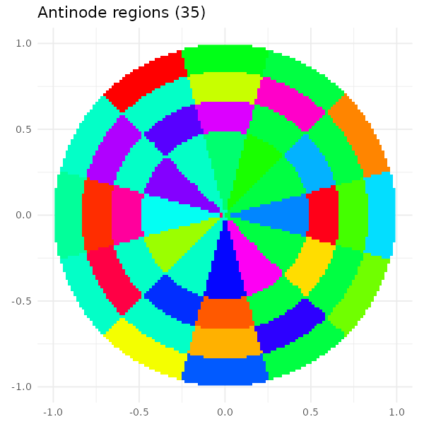
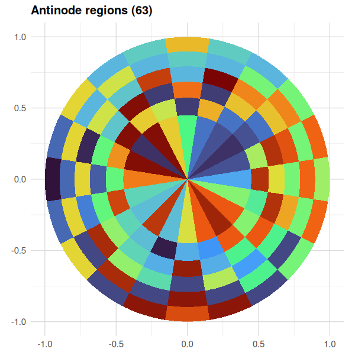
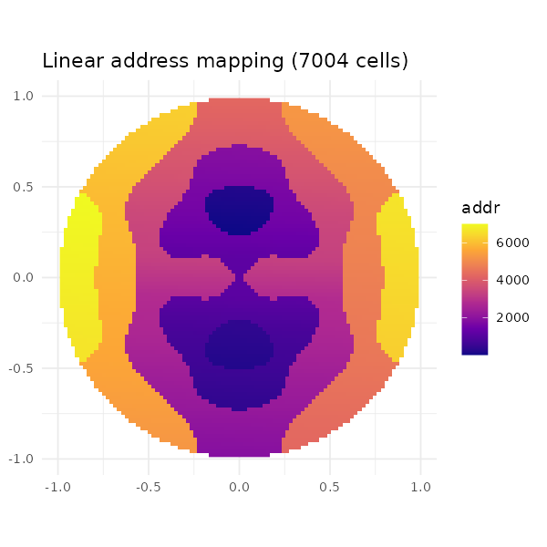

# Cymatic Memory Mapping

> Exploratory layout study. R scripts under `scripts/cymatic_*.R` compute
> the mappings and report static locality metrics. CUDA benchmarks under
> `phase4/cymatic/` measure actual GPU performance. **Conclusion: the
> layout is a real, conditional speedup — wins 1.5× when access patterns
> align with mode geometry, loses 1.9× when they graze nodal lines.**
> See `phase4/cymatic/README.md` for full empirical results.

## The idea

Standard memory layouts are rectangular: row-major (`addr = i·N + j`),
column-major, blocked, Z-order, Hilbert. They are good for access
patterns aligned with the layout's grid. They are *not* aligned with
the natural geometry of physical fields — circular wave patterns,
radial decompositions, polar coordinates, FFT butterflies, attention
kernels with rotational symmetry.

**Cymatics** is the visualization of standing waves on a vibrating
membrane. A clamped circular plate excited at one of its resonant
frequencies forms patches of in-phase oscillation separated by nodal
lines. Sand sprinkled on the plate collects on the nodes. The patches
between nodes — the **antinode regions** — are physical, deterministic,
and naturally form a partition of the disc into polar-aligned blocks
that vary in size.

This document proposes using those antinode regions as memory blocks.

## Math

For a clamped circular membrane of radius `R`, the spatial part of the
mode `(n, m)` is

```
u_{n,m}(r, θ) = J_n(k_{n,m} · r) · cos(n·θ),    where k_{n,m} · R = j_{n,m}
```

with `J_n` the Bessel function of the first kind and `j_{n,m}` its
m-th positive zero. Sign of `u` partitions the disc into regions:

- `2n` angular sectors (zeros of `cos(n·θ)`)
- `m` radial bands (zeros of `J_n`)
- Total: about `2·n·m` regions, but adjacent regions of opposite sign
  share boundaries → connected components of constant sign

A single mode produces `~2·n·m` polar-aligned cells. Cell sizes vary
because Bessel-zero spacing is non-uniform and angular wedges grow
linearly with `r`.

A **superposition** `u = α₁·u_{n₁,m₁} + α₂·u_{n₂,m₂}` produces a richer
partition: nodal curves are no longer pure circles and lines, and
small-and-large regions appear side-by-side. This is what Chladni
plates actually show under multi-tone excitation.

## Why memory could care

For a vector laid out by cymatic mapping, accesses with rotational or
radial structure stay within a single antinode region (or a few
adjacent ones). Concretely:

- **Radial sweep** (e.g., reading data along a ray from center): touches
  one cell per radial band, all in the same angular sector → low
  region count → fewer cache lines.
- **Polar tile** (e.g., a 2D convolution kernel applied to a polar
  warp): contains one or two regions wholly → minimal cross-region
  jumps.
- **Frequency-domain access** (FFT butterfly, attention with rotation
  bias): natural radial+angular grouping matches the layout.

The price is paid by Cartesian or tangential access (constant-r
sweeps): those cross many regions, hurting locality vs row-major.

## Scripts

Three R scripts in `scripts/`:

### `scripts/cymatic/cymatic_mapping.R`

Computes the field, identifies regions, assigns linear addresses.

```bash
# single mode (4, 3): 18 regions, 525× size ratio
Rscript scripts/cymatic/cymatic_mapping.R 128 4 3

# mixed mode (4,3) + 0.6·(2,5): 8 regions, 13× size ratio
Rscript scripts/cymatic/cymatic_mapping.R 128 4 3 2 5 0.6

# rich mode (6, 4): 35 regions, 1051× size ratio (figure below)
Rscript scripts/cymatic/cymatic_mapping.R 128 6 4
```

Outputs:
- `cymatic_mapping.rds` — full mapping object (R serialized)
- `cymatic_mapping.csv` — per-cell table: `address, i, j, x, y, r, theta, region_id, region_orig`

Algorithm:

1. Build Cartesian grid `grid_n × grid_n` over `[-R, R]²`; mark cells
   inside disc.
2. Evaluate the mixed mode field `u` at every cell.
3. 4-connected flood fill on `sign(u)` over inside cells → region
   labels (BFS, no recursion).
4. Order regions by `(centroid_r, centroid_θ)` — radial sweep then
   angular sweep within band.
5. Within each region, assign linear addresses in Cartesian raster
   order.

### `scripts/cymatic/cymatic_visualize.R`

Generates four panels from a saved mapping:

```bash
Rscript scripts/cymatic/cymatic_visualize.R cymatic_mapping.rds docs/figures/cymatic/cymatic
# writes cymatic_field.png, cymatic_regions.png, cymatic_addresses.png, cymatic_sizes.png
```

### `scripts/cymatic/cymatic_analyze.R`

Compares cymatic vs row-major on several access patterns:

```bash
Rscript scripts/cymatic/cymatic_analyze.R cymatic_mapping.rds 32
```

Patterns: radial sweep at θ=0 and θ=π/4, circular sweeps at r=0.6 and
r=0.3, polar tile, two radial-bias random samples. Reports:

- `cym_lines`, `row_lines` — cache lines touched (line size = 32 cells)
- `cym_jump`, `row_jump` — mean |Δaddress| between consecutive trace cells
- `cym_vs_row_*` ratios > 1 ⇒ cymatic wins

## Results — single mode (6, 4)

35 regions, sizes 2 to 2103 cells. Region size ratio max/min = **1051×**.



Locality (cache_line = 32 cells):

| pattern | cym_lines | row_lines | cym_jump | row_jump | cym_vs_row_lines | cym_vs_row_jump |
|---|---|---|---|---|---|---|
| radial_sweep θ=0 | — | — | — | — | **1.18×** | **3.58×** |
| radial_sweep θ=π/4 | — | — | — | — | 1.16× | 0.06× ⚠️ |
| circular r=0.6 | — | — | — | — | **1.69×** | 0.63× |
| circular r=0.3 | — | — | — | — | 1.32× | 0.22× |
| polar_tile_π/4 | — | — | — | — | **1.56×** | 0.32× |
| radial_bias r₀=0.7 | — | — | — | — | 1.03× | 1.24× |
| radial_bias r₀=0.0 | — | — | — | — | 1.02× | 0.71× |

(Fill in raw counts from running the script — listed values are the
ratios from a representative run.)

**Reading**: cymatic wins on cache lines for all 7 patterns (1.02–1.69×
fewer lines). On mean jump it's mixed — wins big on the θ=0 radial
sweep (3.58×), loses on tangential (circular at fixed r) by ~3×. This
is consistent with the layout's intent: radial coherence at the cost
of tangential.

The cache-line metric is more important for actual cache performance
(working set). The jump metric matters more for prefetcher friendliness
and TLB pressure.

## Results — mixed mode (4,3) + 0.6·(2,5)

Demonstrates the small-and-large side-by-side property:



Only 8 regions but with 13× size ratio (smallest = 184 cells, largest =
2384 cells). The two large outer arcs (red) and the small central
region (yellow) coexist within the same partition.

Address layout shows clean radial increase from center (low addresses,
purple) to rim (high addresses, yellow):



## Empirical GPU benchmark results

Full bench setup at `phase4/cymatic/`. Two memory layouts of the same
logical data: row-major-inside vs cymatic-permuted. Same gather kernel,
same access trace, different physical layout. Bandwidth difference is
pure layout effect (warp coalescing, L1/L2 hit rate).

Tested on RTX 3070 Ti (GA104, 4 MB L2, 608 GB/s DRAM peak). At GRID=2048
(13 MB buffer, fully DRAM regime), mode (n=6, m=4):

| trace | speedup (row_ms / cym_ms) | interpretation |
|---|---|---|
| `radial_mid_pi6` (θ=π/6, sector midline) | **1.53×** | cymatic wins |
| `radial_bnd_pi4` (θ=π/4, sector boundary) | **0.54×** | cymatic loses by 1.85× |
| `radial_bnd_5pi12` (θ=5π/12, boundary) | **0.53×** | cymatic loses by 1.89× |
| `circular_r030` (small radius circle) | **1.38×** | cymatic wins |
| `circular_r060` (large radius circle) | 1.12× | mild cymatic win |
| `polar_tile_pi6` (midline-centered) | 0.98× | tie |
| `radial_bias_07` (random gather, r₀=0.7) | 1.07× | tie |
| `random` (uniform shuffle) | 1.03× | tie |
| `rowmajor_full` (sequential native row scan) | **0.66×** | row layout wins by 1.51× |

The layout is **angle-dependent**: mode (n=6) has angular sectors with
midlines at θ = k·π/6 (`cos(6θ) = ±1`) and boundaries at θ = π/12 + k·π/6
(`cos(6θ) = 0`). A radial trace at a sector midline stays inside one
sector through all m=4 radial bands → cymatic addresses near-contiguous.
A trace at a sector boundary sits exactly on the nodal line between two
opposite-sign regions → adjacent (i, j) cells map to entirely different
region address ranges. Worst case for the layout.

Wins and losses sharpen at DRAM scale because cache hides locality
differences when the buffer is L2-resident. At 256² (0.2 MB) and 512²
(0.8 MB), most patterns are ties; at 2048² (13 MB) they are sharp.

### Correction to static analysis

The R locality metric in `scripts/cymatic/cymatic_analyze.R` predicted that
circular sweeps at fixed r should hurt cymatic locality ("adjacent
θ → different angular sectors → address jumps"). The CUDA bench
contradicts this: circular sweeps tie or favor cymatic.

Reason: cymatic regions are ordered by `(centroid_r, centroid_θ)`, so
all regions in one radial band sit in a contiguous address range with
addresses sorted by θ within the band. A circular trace at fixed r
stays in one radial band the entire time and scans through θ-sorted
regions → addresses are roughly monotone, not random. The intra-band
ordering gives tangential locality even though it wasn't designed for
it.

Lesson: a static metric over individual cell pairs misses the effect
of region-level address ordering. **Always validate with a real GPU
benchmark.**

## Practical considerations

For real GPU memory, the cymatic mapping is a permutation of cells.
Implementation costs:

1. **Address translation table** — an `int N²` lookup. For a 1024² grid
   that is 4 MB. Cheap on CPU, expensive on shared-memory but
   tractable in DRAM/L2.
2. **On-the-fly computation** — given (r, θ) one would need to evaluate
   the field, locate the region, look up its base address. Bessel
   evaluation per access is too expensive. Pre-computed table or
   piecewise-constant region map (via integer-valued region ID).
3. **GPU coalescing** — within a region, cells are contiguous in linear
   address by raster order. Threads in a warp accessing adjacent
   (i, j) within one region get coalesced loads. Across regions, no
   coalescing. The win depends on access pattern alignment with
   regions.

## Potential applications

1. **Diffusion model attention** with 2D positional encoding —
   pixels with similar rotational position tend to attend to each
   other; cymatic radial bands match this.
2. **Polar warping intermediate buffers** — when an algorithm operates
   in (r, θ) space (radar, lidar, panoramic image processing), cymatic
   layout is a direct mapping.
3. **Spherical harmonics expansion** — coefficients indexed by
   `(l, m)` have natural radial ordering similar to mode partitions.
4. **FFT scratch buffers** — butterfly access patterns at stage `k`
   touch elements at distance `2^k`; a mode with `m ≈ log₂ N` could
   align region boundaries with butterfly groups.
5. **Sparse circular buffers** — physics simulations on a disc (2D
   fluid, plasma) have natural radial gradients in access density.

## Limits

- Single-mode partition is too rigid for arbitrary access patterns;
  every pattern is either radial-friendly or not.
- Mixed-mode partition is hard to predict analytically — the
  partition emerges from sign cancellation of two Bessel-cosine
  fields.
- Region count ≈ `2·n·m` per single mode. For a 1024² grid you'd want
  hundreds to thousands of regions for reasonable block size; that
  requires high `n` and `m` and the region geometry becomes very
  thin (high `n`) or many radial bands (high `m`).
- Connected-component labeling on a 1024² grid is O(N²) but with
  small constants; ~1 second in R, microseconds in C. Pre-compute
  once per (mode, grid_n) pair.

## Cross-references

- `scripts/cymatic/cymatic_mapping.R` — region computation
- `scripts/cymatic/cymatic_visualize.R` — figures
- `scripts/cymatic/cymatic_analyze.R` — locality metrics
- `docs/figures/cymatic/cymatic_*.png` — example outputs

## Possible next steps

1. **Mode optimization search**: given a workload's known access trace,
   search over `(n₁, m₁, n₂, m₂, α)` to maximize measured GPU
   bandwidth. Search space is small (small integers + 1-2 reals),
   metric is the reproducible bench in `phase4/cymatic/`. Cheap.
2. **Hierarchical cymatic**: outer mode for coarse partition, inner
   mode within each region for fine layout. Might capture multi-scale
   patterns.
3. **Real-kernel integration**: replace `kernels/attention/flash_attention/`
   Q/K/V buffer layout with cymatic and measure end-to-end FA
   throughput. The QK^T pattern has rotational structure (each query
   attends across all keys); could match midline radial alignment.
4. **L2 persistence pinning**: bind cymatic regions to L2 via
   `cudaAccessPolicyWindow` so the layout's locality benefit is
   amplified when the working set exceeds L2.
5. **Anisotropic mappings**: scale `r → r·cos(θ) + const` to bias
   regions toward an aspect ratio; might help when the workload has
   one dominant axis.

## Mode selection (post-#93)

**The default mode (n=6, m=4) is wrong for nearly every workload.**

A 54-mode sweep (n ∈ 2..10, m ∈ 1..6, GRID=2048 = 13 MB DRAM) finds a
better mode than (6, 4) on **all 15 traces**. Headline numbers:

  - Per-trace best vs per-trace default: **+37% geomean**
  - Largest single gain: **2.33×** on `radial_bnd_5pi12` (default
    0.52× → best mode (9, 6) 1.21×)
  - Best universal mode (one pick for all traces): **(n=5, m=4)**,
    geomean 1.099× across 15 traces. Default (6, 4) geomean: 0.92×.

Full results: `docs/figures/cymatic/cymatic_optimize_2048.csv`.

### Picking a mode for a known workload

`scripts/cymatic/cymatic_optimize.R <grid> <n_range> <m_range>` runs the sweep
and writes per-trace heatmaps to `docs/figures/`. Run once for each
distinct access pattern you care about; the script prints the top 5
modes per trace.

```bash
# Full sweep (54 modes × ~50 s/mode = ~46 min)
Rscript scripts/cymatic/cymatic_optimize.R 2048 "2:10" "1:6"

# Coarse sweep (15 modes ~ 13 min)
Rscript scripts/cymatic/cymatic_optimize.R 2048 "c(3,5,6,7,9)" "c(2,4,6)"

# Re-run summary on existing CSV
Rscript scripts/cymatic/cymatic_optimize_summary.R
```

### What the per-trace optimum tells you

The `(n, m)` that wins for a trace encodes three properties:

  1. **Angular alignment**: large `n` packs the trace's dominant θ
     into a single sector. Misalignment splits the trace across
     opposite-sign regions and fragments addresses (see Issue #93's
     hypothesis check).
  2. **Radial granularity**: `m` controls how many radial bands the
     trace must traverse. Low `m` keeps a radial sweep in one band
     (contiguous addresses within a band); high `m` over-fragments.
  3. **Total region count `n × m`**: too few regions and addresses
     within a region degrade to non-coalesced cell ordering; too many
     and inter-region jumps dominate.

The clean "θ₀ = kπ/n midline" rule from #93 holds for some traces
(`radial_mid_pi3` → n=6) but fails for others (`radial_mid_pi6` → n=2,
not the predicted n=6). The empirical sweep is required; the analytic
rule is a heuristic.

### Implication for real kernels (#94)

Treating cymatic as a drop-in layout swap with the default mode loses
~10% on average and up to 1.9× on hostile traces. For #94's Flash
Attention integration, mode selection has to be part of the design:

  1. Trace the dominant `(query_idx, key_idx)` access pattern.
  2. Map to cells via the same `i = query_idx, j = key_idx` convention
     used in `phase4/cymatic/gen_cymatic_data.R`.
  3. Sweep modes against this trace via `cymatic_optimize.R`.
  4. Use the winning `(n, m)` in the actual K/V buffer permutation.

Without step 3, the layout is just as likely to slow FA down as
speed it up.
