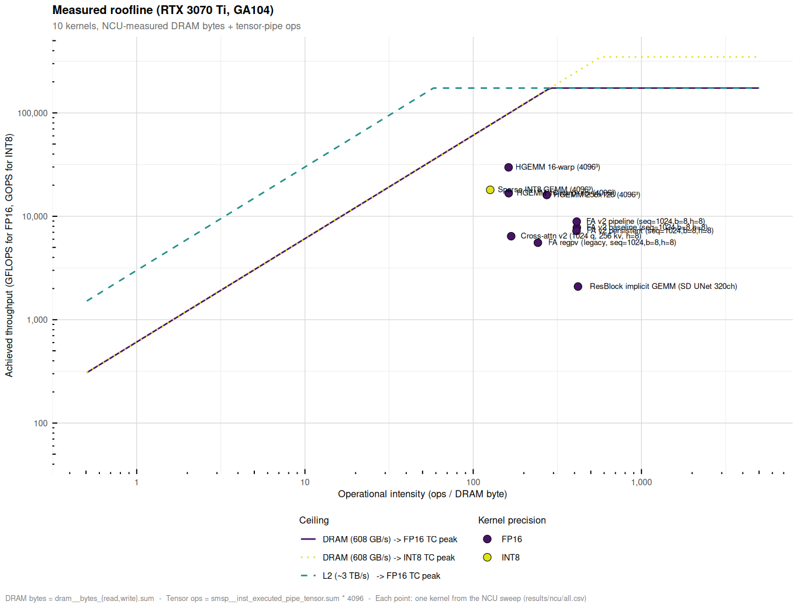

# Measured Roofline

> Detail view. Canonical entry point for all per-kernel comparisons:
> [`docs/kernels.md`](kernels.md).

Auto-generated by `scripts/roofline_measured.R`.

Operational intensity is **measured**, not estimated:

  OI_DRAM = (tensor_count * 4096) / (dram_read_bytes + dram_write_bytes)

Tensor ops = HMMA (FP16) + IMMA (INT8) instructions, each contributing
16x8x16 muladds = 4096 ops per warp instruction.

## Per-kernel data

| kernel | precision | OI_DRAM | OI_L2 | achieved GFLOPS | DRAM (MB/launch) | duration (us) |
|---|---|---:|---:|---:|---:|---:|
| HGEMM 16-warp (4096³) | FP16 | 162.3 | 41.8 | 29751 | 807.5 | 4619 |
| Sparse INT8 GEMM (4096³) | INT8 | 126.2 | 34.3 | 18035 | 519.4 | 3811 |
| HGEMM 16-warp+epi (4096³) | FP16 | 162.5 | 62.0 | 16730 | 806.7 | 8214 |
| HGEMM 256x128 (4096³) | FP16 | 273.6 | 81.8 | 16073 | 478.9 | 8550 |
| FA v2 pipeline (seq=1024,b=8,h=8) | FP16 | 412.4 | 56.8 | 8892 | 39.7 | 1932 |
| FA v2 baseline (seq=1024,b=8,h=8) | FP16 | 412.9 | 57.8 | 7773 | 39.7 | 2210 |
| FA v2 persistent (seq=1024,b=8,h=8) | FP16 | 411.2 | 57.3 | 7227 | 39.8 | 2377 |
| Cross-attn v2 (1024 q, 256 kv, h=8) | FP16 | 168.1 | 44.6 | 6417 | 3.0 | 84 |
| FA regpv (legacy, seq=1024,b=8,h=8) | FP16 | 242.4 | 30.8 | 5554 | 67.6 | 3093 |
| ResBlock implicit GEMM (SD UNet 320ch) | FP16 | 419.5 | 19.0 | 2092 | 4.3 | 902 |

## Regime classification

Below the DRAM ceiling line: **bandwidth-bound**.
Between DRAM and L2 ceiling: **bandwidth-bound** but L2 is helping.
Above L2 ceiling: **compute-bound** (cannot be helped by more bandwidth).

Total tensor-active kernels measured: **10**
