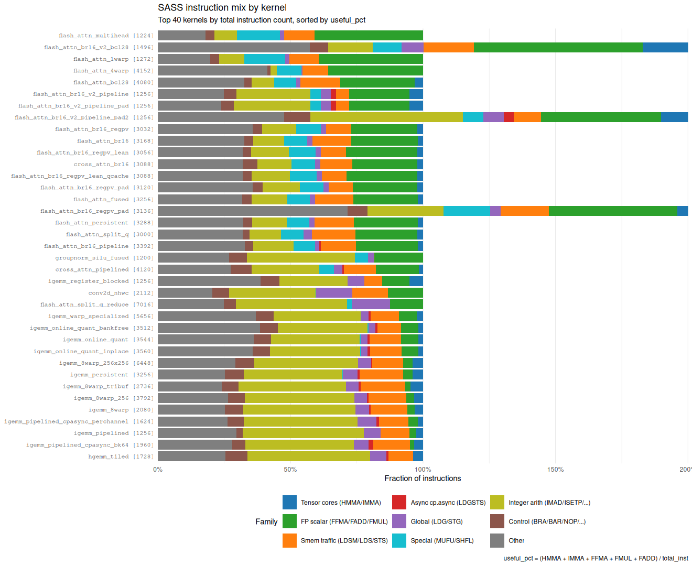

# SASS Instruction Histogram

Auto-generated by `scripts/sass_histogram.R`.

`useful_pct` = (HMMA + IMMA + FFMA + FMUL + FADD) / total_inst.
Sort: highest `useful_pct` first.

See [Observation AA in `docs/gpu_reflections.md`](gpu_reflections.md)
for the trend analysis (median useful_pct = 12.5%, family rankings,
why FFMA-dense beats HMMA-dense in useful_pct but loses in TFLOPS).

| kernel | total_inst | HMMA | IMMA | LDSM | LDGSTS | FFMA | MUFU | IMAD | BRA | useful_pct |
|---|---:|---:|---:|---:|---:|---:|---:|---:|---:|---:|
| sgemm_register_blocked | 1016 | 0 | 0 | 0 | 0 | 512 | 0 | 50 | 18 | 50.4% |
| flash_attn_multihead | 1224 | 0 | 0 | 0 | 0 | 138 | 38 | 20 | 15 | 40.8% |
| flash_attn_br16_v2_bc128 | 1496 | 128 | 0 | 96 | 0 | 13 | 72 | 21 | 22 | 40.4% |
| flash_attn_br16_v2_bc128 | 1496 | 128 | 0 | 96 | 0 | 13 | 72 | 21 | 22 | 40.4% |
| flash_attn_1warp | 1272 | 0 | 0 | 0 | 0 | 138 | 38 | 16 | 26 | 39.3% |
| gelu_kernel | 72 | 0 | 0 | 0 | 0 | 4 | 4 | 3 | 1 | 38.9% |
| gelu_kernel | 72 | 0 | 0 | 0 | 0 | 4 | 4 | 3 | 1 | 38.9% |
| flash_attn_4warp | 4152 | 0 | 0 | 0 | 0 | 264 | 70 | 16 | 21 | 35.8% |
| flash_attn_br16_v2 | 1024 | 64 | 0 | 48 | 0 | 13 | 40 | 55 | 22 | 34.1% |
| cross_attn_v2 | 1040 | 64 | 0 | 48 | 0 | 13 | 40 | 63 | 22 | 33.6% |
| flash_attn_v2_persistent | 1088 | 64 | 0 | 48 | 0 | 13 | 42 | 82 | 25 | 32.1% |
| flash_attn_bc128 | 4080 | 128 | 0 | 96 | 0 | 70 | 180 | 154 | 58 | 31.2% |
| flash_attn_v2_persistent_pad | 1120 | 64 | 0 | 48 | 0 | 13 | 42 | 97 | 25 | 31.2% |
| flash_attn_br16_regpv_full | 1128 | 64 | 0 | 48 | 0 | 13 | 40 | 86 | 29 | 30.9% |
| flash_attn_br16_v2_pad | 1184 | 64 | 0 | 48 | 0 | 13 | 40 | 116 | 22 | 29.5% |
| flash_attn_br16_v2_pad | 1184 | 64 | 0 | 48 | 0 | 13 | 40 | 116 | 22 | 29.5% |
| cross_attn_v2_pad | 1184 | 64 | 0 | 48 | 0 | 13 | 40 | 116 | 22 | 29.5% |
| layernorm_warp | 384 | 0 | 0 | 0 | 0 | 78 | 14 | 11 | 33 | 28.4% |
| layernorm_block | 664 | 0 | 0 | 0 | 0 | 124 | 21 | 17 | 55 | 28.0% |
| flash_attn_br16_v2_pipeline_pad2 | 1256 | 64 | 0 | 48 | 24 | 13 | 40 | 159 | 30 | 27.8% |
| flash_attn_br16_v2_pipeline_pad | 1256 | 64 | 0 | 48 | 24 | 13 | 40 | 160 | 30 | 27.8% |
| flash_attn_br16_v2_pipeline_pad2 | 1256 | 64 | 0 | 48 | 24 | 13 | 40 | 159 | 30 | 27.8% |
| flash_attn_br16_v2_pipeline | 1256 | 64 | 0 | 48 | 24 | 13 | 40 | 144 | 30 | 27.8% |
| flash_attn_br16_regpv | 3032 | 64 | 0 | 48 | 0 | 70 | 116 | 226 | 52 | 27.1% |
| flash_attn_br16 | 3168 | 64 | 0 | 48 | 0 | 70 | 116 | 190 | 56 | 27.0% |
| flash_attn_br16_regpv_lean | 3056 | 64 | 0 | 48 | 0 | 70 | 116 | 248 | 53 | 26.9% |
| flash_attn_br16_regpv_lean_qcache | 3088 | 64 | 0 | 48 | 0 | 70 | 116 | 262 | 54 | 26.7% |
| cross_attn_br16 | 3088 | 64 | 0 | 48 | 0 | 55 | 116 | 192 | 119 | 26.7% |
| flash_attn_br16_regpv_pad | 3120 | 64 | 0 | 48 | 0 | 70 | 116 | 251 | 59 | 26.4% |
| flash_attn_fused | 3256 | 64 | 0 | 48 | 0 | 70 | 116 | 218 | 63 | 26.3% |
| flash_attn_br16_regpv_pad | 3136 | 64 | 0 | 48 | 0 | 70 | 116 | 259 | 59 | 26.2% |
| flash_attn_br16_regpv_pad | 3136 | 64 | 0 | 48 | 0 | 70 | 116 | 259 | 59 | 26.2% |
| flash_attn_persistent | 3288 | 64 | 0 | 48 | 0 | 70 | 118 | 228 | 76 | 26.0% |
| flash_attn_split_q | 3000 | 64 | 0 | 48 | 0 | 31 | 97 | 210 | 38 | 25.5% |
| flash_attn_br16_pipeline | 3392 | 64 | 0 | 48 | 24 | 70 | 116 | 267 | 64 | 25.2% |
| gelu_fast | 144 | 0 | 0 | 0 | 0 | 8 | 10 | 12 | 12 | 19.4% |
| gelu_fast | 144 | 0 | 0 | 0 | 0 | 8 | 10 | 12 | 12 | 19.4% |
| sgemm_tiled | 168 | 0 | 0 | 0 | 0 | 32 | 0 | 8 | 3 | 19.0% |
| groupnorm_silu_fused | 1200 | 0 | 0 | 0 | 0 | 129 | 44 | 228 | 61 | 18.4% |
| timestep_emb_with_silu_scale | 72 | 0 | 0 | 0 | 0 | 2 | 8 | 7 | 1 | 18.1% |
| cross_attn_pipelined | 4120 | 64 | 0 | 48 | 24 | 55 | 68 | 533 | 284 | 17.7% |
| softmax_block | 248 | 0 | 0 | 0 | 0 | 9 | 9 | 33 | 20 | 17.3% |
| softmax_warp | 128 | 0 | 0 | 0 | 0 | 9 | 6 | 13 | 8 | 17.2% |
| groupnorm_nchw | 1000 | 0 | 0 | 0 | 0 | 112 | 28 | 205 | 47 | 17.2% |
| groupnorm | 1008 | 0 | 0 | 0 | 0 | 112 | 28 | 208 | 47 | 17.1% |
| silu_kernel | 144 | 0 | 0 | 0 | 0 | 8 | 10 | 14 | 12 | 16.7% |
| silu_kernel | 144 | 0 | 0 | 0 | 0 | 8 | 10 | 14 | 12 | 16.7% |
| igemm_register_blocked | 1256 | 0 | 64 | 8 | 0 | 0 | 0 | 150 | 35 | 15.4% |
| hgemm_16warp_aligned | 440 | 64 | 0 | 32 | 8 | 0 | 0 | 106 | 6 | 14.5% |
| sgemm_naive | 216 | 0 | 0 | 0 | 0 | 29 | 0 | 42 | 11 | 13.4% |
| conv2d_nhwc | 2112 | 0 | 0 | 0 | 0 | 279 | 1 | 287 | 108 | 13.2% |
| flash_attn_split_q_reduce | 7016 | 0 | 0 | 0 | 0 | 375 | 132 | 729 | 262 | 12.5% |
| timestep_emb_single | 40 | 0 | 0 | 0 | 0 | 0 | 4 | 2 | 1 | 12.5% |
| timestep_emb_batch | 48 | 0 | 0 | 0 | 0 | 0 | 4 | 5 | 1 | 10.4% |
| igemm_warp_specialized | 5656 | 0 | 128 | 16 | 48 | 288 | 4 | 963 | 283 | 9.1% |
| igemm_online_quant_bankfree | 3512 | 0 | 64 | 8 | 32 | 160 | 4 | 654 | 177 | 8.3% |
| residual_add | 48 | 0 | 0 | 0 | 0 | 0 | 0 | 5 | 1 | 8.3% |
| igemm_online_quant_inplace | 3560 | 0 | 64 | 8 | 32 | 160 | 4 | 695 | 177 | 8.2% |
| igemm_online_quant | 3544 | 0 | 64 | 8 | 32 | 160 | 4 | 678 | 177 | 8.2% |
| hgemm_256x128 | 792 | 64 | 0 | 24 | 6 | 0 | 0 | 138 | 23 | 8.1% |
| igemm_tiled | 608 | 0 | 16 | 4 | 0 | 0 | 0 | 79 | 24 | 8.1% |
| igemm_tiled | 608 | 0 | 16 | 4 | 0 | 0 | 0 | 79 | 24 | 8.1% |
| igemm_tiled | 608 | 0 | 16 | 4 | 0 | 0 | 0 | 79 | 24 | 8.1% |
| igemm_8warp_256x256 | 6448 | 0 | 256 | 16 | 32 | 0 | 0 | 1119 | 290 | 7.5% |
| igemm_persistent | 3256 | 0 | 128 | 8 | 24 | 0 | 1 | 567 | 149 | 7.4% |
| conv2d_1x1_nhwc | 448 | 0 | 0 | 0 | 0 | 31 | 0 | 96 | 24 | 6.9% |
| igemm_8warp_tribuf | 2736 | 0 | 128 | 16 | 24 | 0 | 0 | 493 | 116 | 6.8% |
| hgemm_tiled_direct | 992 | 64 | 0 | 24 | 16 | 0 | 0 | 189 | 43 | 6.5% |
| igemm_8warp_256 | 3792 | 0 | 128 | 8 | 24 | 0 | 0 | 696 | 163 | 6.4% |
| igemm_sparse_tiled | 1064 | 0 | 32 | 8 | 2 | 0 | 0 | 187 | 26 | 6.1% |
| igemm_sparse_tiled | 1064 | 0 | 32 | 8 | 2 | 0 | 0 | 187 | 26 | 6.1% |
| hgemm_16warp | 544 | 32 | 0 | 16 | 4 | 0 | 0 | 139 | 15 | 5.9% |
| igemm_8warp | 2080 | 0 | 64 | 8 | 16 | 0 | 0 | 392 | 90 | 5.8% |
| igemm_sparse_tiled | 1120 | 0 | 32 | 8 | 4 | 0 | 0 | 176 | 40 | 5.8% |
| igemm_pipelined_cpasync | 1136 | 0 | 32 | 8 | 16 | 0 | 0 | 140 | 39 | 5.7% |
| igemm_sparse_tiled_persistent | 1184 | 0 | 32 | 8 | 4 | 0 | 1 | 167 | 32 | 5.5% |
| igemm_pipelined_cpasync_perchannel | 1624 | 0 | 32 | 8 | 16 | 0 | 0 | 292 | 59 | 5.4% |
| igemm_pipelined | 1256 | 0 | 32 | 8 | 0 | 0 | 0 | 212 | 7 | 5.2% |
| igemm_pipelined_cpasync_bk64 | 1960 | 0 | 64 | 16 | 32 | 0 | 0 | 231 | 71 | 4.9% |
| hgemm_sparse_tiled | 720 | 32 | 0 | 40 | 4 | 0 | 0 | 93 | 31 | 4.4% |
| igemm_wmma | 432 | 0 | 10 | 0 | 0 | 0 | 0 | 127 | 13 | 4.4% |
| hgemm_tiled | 1728 | 64 | 0 | 24 | 16 | 0 | 0 | 374 | 91 | 3.7% |
| hgemm_16warp_epi | 952 | 32 | 0 | 16 | 8 | 0 | 0 | 205 | 47 | 3.4% |
| probe_frag_b_row | 240 | 0 | 0 | 1 | 0 | 0 | 0 | 34 | 6 | 3.3% |
| probe_frag_a | 240 | 0 | 0 | 1 | 0 | 0 | 0 | 34 | 6 | 3.3% |
| hgemm_16warp_epi_pad | 976 | 32 | 0 | 16 | 8 | 0 | 0 | 243 | 47 | 3.3% |
| probe_frag_b_row | 240 | 0 | 0 | 1 | 0 | 0 | 0 | 34 | 6 | 3.3% |
| probe_frag_a | 240 | 0 | 0 | 1 | 0 | 0 | 0 | 34 | 6 | 3.3% |
| vector_add | 32 | 0 | 0 | 0 | 0 | 0 | 0 | 4 | 1 | 3.1% |
| residual_add | 32 | 0 | 0 | 0 | 0 | 0 | 0 | 3 | 1 | 3.1% |
| probe_frag_b_col | 280 | 0 | 0 | 1 | 0 | 0 | 0 | 44 | 6 | 2.9% |
| probe_frag_b_col | 280 | 0 | 0 | 1 | 0 | 0 | 0 | 44 | 6 | 2.9% |
| hgemm_wmma | 392 | 10 | 0 | 0 | 0 | 0 | 0 | 79 | 13 | 2.6% |
| wmma_gemm_conv | 544 | 8 | 0 | 5 | 0 | 0 | 0 | 128 | 23 | 1.5% |
| implicit_gemm_conv | 672 | 8 | 0 | 5 | 0 | 0 | 4 | 178 | 27 | 1.2% |
| hgemm_sparse_naive | 456 | 2 | 0 | 0 | 0 | 0 | 0 | 101 | 25 | 0.4% |
| relu_kernel | 48 | 0 | 0 | 0 | 0 | 0 | 0 | 6 | 1 | 0.0% |
| relu_kernel | 48 | 0 | 0 | 0 | 0 | 0 | 0 | 6 | 1 | 0.0% |
| im2col_nhwc_fp16 | 288 | 0 | 0 | 0 | 0 | 0 | 6 | 112 | 5 | 0.0% |
| transpose_bhsd | 112 | 0 | 0 | 0 | 0 | 0 | 3 | 38 | 1 | 0.0% |
| transpose_bshd | 112 | 0 | 0 | 0 | 0 | 0 | 3 | 38 | 1 | 0.0% |
| fp16_to_fp32 | 40 | 0 | 0 | 0 | 0 | 0 | 0 | 7 | 1 | 0.0% |
| fp32_to_fp16 | 40 | 0 | 0 | 0 | 0 | 0 | 0 | 7 | 1 | 0.0% |
